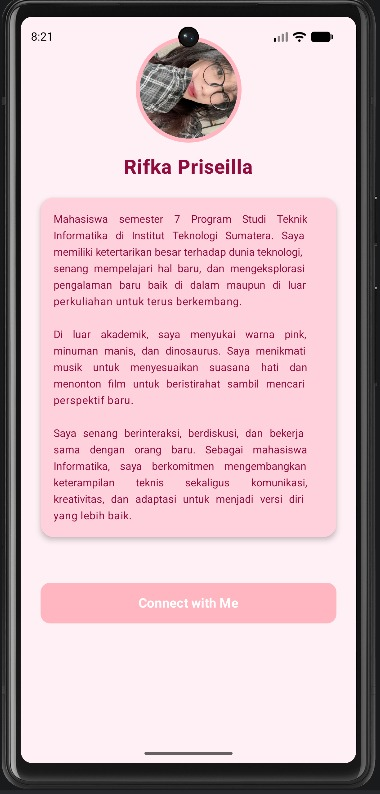
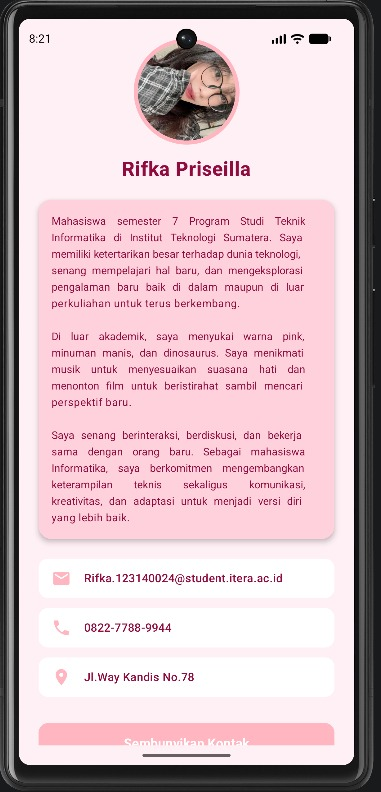

# Tugas Praktikum Minggu 3 - My Profile App

**Pengembangan Aplikasi Mobile - Jetpack Compose Multiplatform Basics**

- **Nama:** Rifka Priseilla Br Silitonga
- **NIM:** 123140024
- **Program Studi:** Teknik Informatika
- **Institut:** Institut Teknologi Sumatera (ITERA)

## Deskripsi Aplikasi
Aplikasi **My Profile App** adalah portofolio digital sederhana yang dibangun menggunakan paradigma UI Deklaratif Jetpack Compose. Aplikasi ini menggunakan tema kustom *Pink Soft Pastel* dan memisahkan setiap elemen antarmuka menjadi komponen yang dapat digunakan kembali (*reusable*).

## Preview Aplikasi
Aplikasi ini dilengkapi dengan fitur **AnimatedVisibility** (Bonus). Daftar kontak (Email, Phone, Location) disembunyikan secara bawaan dan akan meluncur ke bawah dengan animasi transisi yang halus ketika tombol ditekan.

|                   Layar Utama (Bawaan)                    |            Layar Setelah Tombol Ditekan (Animasi)            |
|:---------------------------------------------------------:|:------------------------------------------------------------:|
|  |  |
