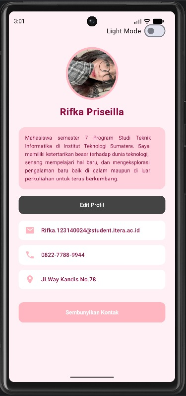
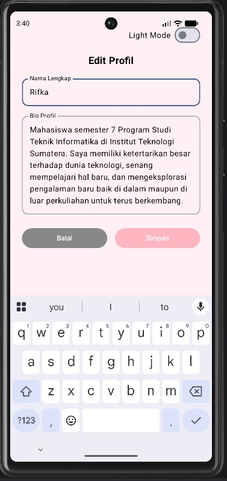
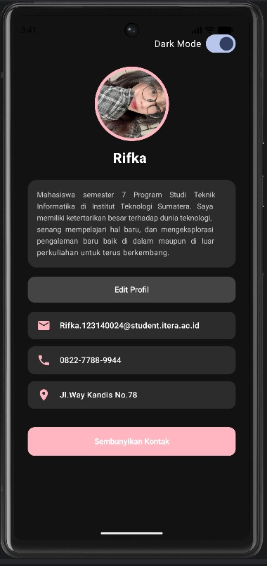

# Tugas Praktikum 4 - Pengembangan Aplikasi Mobile
**State Management dan Architecture Pattern (MVVM)**

## Identitas
- **Nama:** Rifka Priseilla Br Silitonga.
- **NIM:** 123140024
- **Program Studi:** Teknik Informatika
- **Institut:** Institut Teknologi Sumatera (ITERA)

## Deskripsi Proyek
Proyek ini merupakan kelanjutan dari "My Profile App" (Praktikum 3) yang telah dikembangkan ulang menggunakan arsitektur **Model-View-ViewModel (MVVM)** dan pengelolaan *state* tingkat lanjut pada Jetpack Compose.

## Fitur yang Diimplementasikan
1. **ViewModel Implementation**: Menggunakan `ProfileViewModel` untuk mengelola logika aplikasi dan `StateFlow` untuk mengamati perubahan data.
2. **UI State Pattern**: Membuat *data class* `ProfileUiState` untuk merangkum seluruh status tampilan.
3. **State Hoisting**: Membuat komponen `LabeledTextField` (*stateless*) di mana *state* diangkat ke *parent*.
4. **Edit Feature**: Form fungsional untuk mengedit Nama dan Bio profil yang memperbarui ViewModel secara *real-time*.
5. **Code Structure**: Menerapkan pemisahan folder menjadi `data/`, `viewmodel/`, dan `ui/`.
6. **Bonus Feature**: Menyediakan **Dark Mode Toggle** dengan transisi warna halus menggunakan `animateColorAsState`.

## Screenshot Aplikasi

|        Tampilan Utama (Light Mode)        |           Tampilan Edit Profil            |            Tampilan Dark Mode             |
|:-----------------------------------------:|:-----------------------------------------:|:-----------------------------------------:|
|  |  |  |